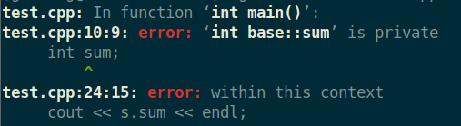
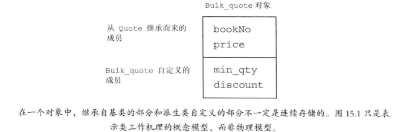

- [第十五章 面向对象程序设计](#第十五章-面向对象程序设计)
  - [1. 面向对象程序设计 有哪些原则？](#1-面向对象程序设计-有哪些原则)
  - [2. 数据抽象](#2-数据抽象)
  - [3. 继承](#3-继承)
    - [3.1 什么是 继承、基类、派生类？](#31-什么是-继承基类派生类)
    - [3.2 基类、派生类 分别负责定义哪些成员？](#32-基类派生类-分别负责定义哪些成员)
    - [3.3 基类的哪些成员会被派生类继承？](#33-基类的哪些成员会被派生类继承)
    - [3.4 如何继承一个类？](#34-如何继承一个类)
  - [4. 动态绑定(dynamic binding)](#4-动态绑定dynamic-binding)
    - [4.1 什么是动态绑定？](#41-什么是动态绑定)
    - [4.2 什么时候会发生动态绑定？](#42-什么时候会发生动态绑定)
    - [4.3 C++是如何实现动态绑定的？](#43-c是如何实现动态绑定的)
    - [4.4 如果发生动态绑定，什么时候可以确定 调用的是哪个版本的虚函数？](#44-如果发生动态绑定什么时候可以确定-调用的是哪个版本的虚函数)
  - [5. 定义基类 和 派生类](#5-定义基类-和-派生类)
    - [5.1 基类需要完成哪些工作？](#51-基类需要完成哪些工作)
    - [5.2 派生类需要做哪些工作？](#52-派生类需要做哪些工作)
    - [5.3 基类的派生类的实例](#53-基类的派生类的实例)
      - [5.3.1 在上面的例子中，类`Bulk_quote`有哪些成员？](#531-在上面的例子中类bulk_quote有哪些成员)
  - [7. 派生类能否访问基类的私有成员？](#7-派生类能否访问基类的私有成员)
  - [8. 如果基类中未提供访问私有成员的`public`函数，那在派生类中这些基类的私有成员是否 “存在“ 呢？还会不会被继承呢？？](#8-如果基类中未提供访问私有成员的public函数那在派生类中这些基类的私有成员是否-存在-呢还会不会被继承呢)
  - [9. 单继承](#9-单继承)
  - [10. 为什么需要`protected`？](#10-为什么需要protected)
  - [11. 一个派生类对象由哪几个部分组成？](#11-一个派生类对象由哪几个部分组成)
  - [12. 派生类及其对象 和 基类 之间的类型转换](#12-派生类及其对象-和-基类-之间的类型转换)
    - [12.1 为什么  派生类及其对象 可以向 基类 转换？](#121-为什么--派生类及其对象-可以向-基类-转换)
    - [12.2 如何进行 派生类及其对象 到 基类 的类型转换？](#122-如何进行-派生类及其对象-到-基类-的类型转换)
    - [12.3 如何把一个从一个基类 转换为 它的派生类？](#123-如何把一个从一个基类-转换为-它的派生类)
  - [14. 派生类的构造函数](#14-派生类的构造函数)
    - [14.1 派生类如何初始化从基类中继承的成员？](#141-派生类如何初始化从基类中继承的成员)
      - [14.1.1 上面的构造函数`Bulk_quote::Bulk_quote()`的执行过程是？](#1411-上面的构造函数bulk_quotebulk_quote的执行过程是)
    - [14.2 如果派生类没有显示调用基类的构造函数对继承自基类成员进行初始化 会发生什么？](#142-如果派生类没有显示调用基类的构造函数对继承自基类成员进行初始化-会发生什么)
  - [15. 基类中的静态成员](#15-基类中的静态成员)
    - [15.1 静态成员和数量 和 派生类的数量有关吗？](#151-静态成员和数量-和-派生类的数量有关吗)
    - [15.2 派生类如何访问基类中的静态成员？](#152-派生类如何访问基类中的静态成员)
  - [16. 如何对派生类进行前向声明？](#16-如何对派生类进行前向声明)
  - [17. 被用作基类的类需要满足什么条件？](#17-被用作基类的类需要满足什么条件)
  - [18. 什么是 直接基类(direct base) 和 间接基类(indirect base)？](#18-什么是-直接基类direct-base-和-间接基类indirect-base)
  - [19. 如何一个类不希望自己被继承，应该如何做？](#19-如何一个类不希望自己被继承应该如何做)
  - [20. 动态类型 与 静态类型](#20-动态类型-与-静态类型)
    - [20.1 什么是 动态类型 和 静态类型？](#201-什么是-动态类型-和-静态类型)
    - [20.2 如何理解“一个对象（变量）的静态类型和动态类型不一定相等”这句话？](#202-如何理解一个对象变量的静态类型和动态类型不一定相等这句话)
    - [20.3 什么情况下一个表达式(变量) 的 动态类型 和 静态类型 会不一样？](#203-什么情况下一个表达式变量-的-动态类型-和-静态类型-会不一样)
    - [20.4 为什么需要区分 变量的 动态类型 和 静态类型？](#204-为什么需要区分-变量的-动态类型-和-静态类型)
    - [20.5 在什么状态下，动态类型 才能发挥作用？](#205-在什么状态下动态类型-才能发挥作用)
  - [21. 能否从基类 向 派生类 转换？为什么？](#21-能否从基类-向-派生类-转换为什么)
  - [22. 下面的代码正确吗？](#22-下面的代码正确吗)
  - [23. 下面的代码原理是什么？](#23-下面的代码原理是什么)
    - [23.1 `Quote item(bulk);`](#231-quote-itembulk)
    - [23.2 `item = bulk;`](#232-item--bulk)
    - [23.3 总结](#233-总结)
  - [24. 当使用派生类为 一个基类对象 初始化(或赋值) 的时候 会发生什么？](#24-当使用派生类为-一个基类对象-初始化或赋值-的时候-会发生什么)
  - [25.存在继承关系的类型之间的转换规则是怎样的？](#25存在继承关系的类型之间的转换规则是怎样的)
  - [26. 虚函数(virtual function)](#26-虚函数virtual-function)
    - [26.1 什么是虚函数(virtual function)](#261-什么是虚函数virtual-function)
    - [26.2 如何声明虚函数？](#262-如何声明虚函数)
    - [26.3 虚函数 和 非虚函数的成员函数 有什么区别？](#263-虚函数-和-非虚函数的成员函数-有什么区别)
    - [26.4 如果派生类没有覆盖它继承的虚函数 会发生什么？](#264-如果派生类没有覆盖它继承的虚函数-会发生什么)
      - [26.5 如何覆盖基类的虚函数？](#265-如何覆盖基类的虚函数)
    - [26.6 虚函数 和 动态绑定 的关系是？](#266-虚函数-和-动态绑定-的关系是)
    - [26.7 在什么时候可以确定 调用的是哪个版本的虚函数 ？](#267-在什么时候可以确定-调用的是哪个版本的虚函数-)
    - [26.8 `override`关键字 有何作用？](#268-override关键字-有何作用)
    - [26.8.1 规则](#2681-规则)
    - [26.8.2 实际应用场景](#2682-实际应用场景)
    - [26.9 基类如果不希望自己的某个成员函数被派生类重写，应该怎么做？](#269-基类如果不希望自己的某个成员函数被派生类重写应该怎么做)
    - [26.10 虚函数 和 默认实参](#2610-虚函数-和-默认实参)
      - [26.10.1 使用虚函数的默认实参时需要注意什么？](#26101-使用虚函数的默认实参时需要注意什么)
      - [26.10.2 为什么会发生上述的这种情况呢？](#26102-为什么会发生上述的这种情况呢)
      - [26.10.3 虚函数使用 默认实参的时候需要注意什么？](#26103-虚函数使用-默认实参的时候需要注意什么)
    - [26.11 在派生类重写的函数中，如果要调用基类中相应的虚函数，应该怎么做？](#2611-在派生类重写的函数中如果要调用基类中相应的虚函数应该怎么做)
    - [基类如何强制派生类一定要覆盖某个函数？](#基类如何强制派生类一定要覆盖某个函数)
  - [27. 多态(polymorphism)](#27-多态polymorphism)
    - [27.1 什么是多态？](#271-什么是多态)
    - [27.2 C++的多态是怎么实现的？](#272-c的多态是怎么实现的)
    - [27.3 动态多态 发生的条件？](#273-动态多态-发生的条件)
  - [28. 在一个类中，哪些函数可以在编译时确定？哪些必须则运行时才能确定？](#28-在一个类中哪些函数可以在编译时确定哪些必须则运行时才能确定)
  - [30 `final`关键字 的作用是？](#30-final关键字-的作用是)
  - [31. 纯虚函数(pure virtual function) 和 抽象基类(abstract base class)](#31-纯虚函数pure-virtual-function-和-抽象基类abstract-base-class)
    - [32.1 纯虚函数 基本概念](#321-纯虚函数-基本概念)
      - [32.1.1 什么是 纯虚函数？](#3211-什么是-纯虚函数)
      - [32.1.2 如何定义虚函数？](#3212-如何定义虚函数)
      - [32.1.3 纯虚函数 可以被定义吗？](#3213-纯虚函数-可以被定义吗)
    - [32.1.3 纯虚函数 和 普通的虚函数 有何区别？](#3213-纯虚函数-和-普通的虚函数-有何区别)
    - [32.2 抽象基类](#322-抽象基类)
      - [32.2.1 什么是 抽象基类？](#3221-什么是-抽象基类)
      - [32.2.2 抽象基类 一般用来做什么？](#3222-抽象基类-一般用来做什么)
      - [32.2.3 抽象基类 和 普通的类有何区别？](#3223-抽象基类-和-普通的类有何区别)
    - [32.3 在`Quote` 和 `Bulk_quote` 之间加一个抽象基类`Disc_quote`来表示](#323-在quote-和-bulk_quote-之间加一个抽象基类disc_quote来表示)
  - [33 派生类的友元](#33-派生类的友元)
  - [覆盖(override)](#覆盖override)
  - [类派生列表中的 访问说明符 的作用是？](#类派生列表中的-访问说明符-的作用是)
    - [虚函数、动态绑定、运行时多态之间的关系](#虚函数动态绑定运行时多态之间的关系)
  - [C++ 类在内存中的存储方式](#c-类在内存中的存储方式)
  - [参考文献](#参考文献)
# 第十五章 面向对象程序设计

## 1. 面向对象程序设计 有哪些原则？
&emsp;&emsp; 面向对象程序设计(object-oriented programming) 的核心思想 基于三个基本概念：数据抽象、继承、动态绑定：
> 使用数据抽象，我们将类的接口和实现分离；
> 使用继承，可以对相似的关系进行建模；
> 使用动态绑定，可以在一定程度上忽略相似类的区别，并以统一的方式使用它们的对象，即在运行时选择执行函数的版本。
> 


&emsp;
&emsp;
## 2. 数据抽象
&emsp;&emsp; 用数据抽象，可以将 类的接口和实现分离，这样只需提供一个头文件给用户就行了，类的实现 对于用户来说是不可见的。


&emsp;
&emsp;
## 3. 继承
### 3.1 什么是 继承、基类、派生类？
&emsp;&emsp; 通过继承(inheritance)联系在一起的类构成一种层次关系。通常在层次关系的根部有一个基类(base class)，其它类都是 直接或间接地 从基类继承而来，这些继承而得到的类称为派生类(derived class)。

### 3.2 基类、派生类 分别负责定义哪些成员？
&emsp;&emsp; 基类负责定义在层次关系中所有类共同拥有的成员，而每个派生类定义各自特有的成员。

### 3.3 基类的哪些成员会被派生类继承？
&emsp;&emsp; 每个类都会继承它直接基类的所有成员。

### 3.4 如何继承一个类？
&emsp;&emsp; 派生类必须通过使用 类派生列表(class derivation list)明确指出它是从哪个(哪些)基类继承而来的。
&emsp;&emsp; 类派生列表的形式是：首先是一个冒号，后面紧跟以逗号分隔的基类列表，其中每个基类前面可以有访问说明符：
```cpp
class bulk_quote : public Quote {
public:
    double net_price(std::size_t n) const override;
};
```


&emsp;
&emsp;
## 4. 动态绑定(dynamic binding)
### 4.1 什么是动态绑定？
&emsp;&emsp; 通过动态绑定(dynamic binding)，我们能用同一段代码分别处理基类和派生类对象：
我们来看下面的代码：
```cpp
// 基类
class Quote {
public:
    std::string isbn() const;
    virtual double net_price(std::size_t n) const;
};

// 派生类
class Bulk_quote : public Quote {
public:
    double net_price(std::size_t n) const override;
};

double print_total(ostream &os, const Quote &item, size_t n)
{
    // 根据 item形参的类型来确定调用  Quote::net_price() 还是 Bulk_quote::net_price()
    double ret = item.net_price(n);
    os << "ISBN: " << item.isbn() // 调用的是基类的isbn()，即 Quote::isbn+
        << " # sold: " << n << " total due: " << ret << endl;
    return ret;
}
```
对于下面的调用：
```cpp
Quote basic;
Bulk_quote bulk;
print_total(cout, basic, 20); // 调用 Quote::net_price()
print_total(cout, bulk, 20); // 调用 Bulk_quote::net_price()
```
> 第一条调用语句将一个`Quote对象`传入了`print_total()`，因此当`print_total()`调用`net_price`的时候执行的是`Quote`的版本；
> 第二条调用语句将一个`Bulk_quote对象`传入了`print_total()`，因此当`print_total()`调用`net_price`的时候执行的是`Bulk_quote`的版本；
> 
在上诉的代码的运行中，函数的运行版本由实参决定，即在运行时选择函数的版本，这就叫动态绑定，也称为运行时绑定(run-time binding)

### 4.2 什么时候会发生动态绑定？
C++ primer原文：在C++语言中，当我们**使用 基类的引用(或指针) 调用一个虚函数时**将发生动态绑定。
&emsp;&emsp; 简单地说，虚函数是动态绑定的基础；动态绑定是实现运行时多态的基础。而要触发 动态绑定，需满足如下两个条件：
> (1)  只有虚函数才能进行动态绑定，非虚函数不进行动态绑定。
> (2)  必须通过 基类类型的引用或指针 进行函数调用。
> 
通过基类指针或基类引用做形参，当实参传入不同的派生类(或基类)的指针或引用，在函数内部触发 动态绑定，从而来 运行时 实现多态的。

### 4.3 C++是如何实现动态绑定的？
&emsp;&emsp; 通过虚函数。当我们**使用指针或引用调用虚函数时**，该调用将执行动态绑定，编译器将根据引用或指针所绑定的对象类型来决定调用对应版本的函数：该调用可能执行基类的版本(指针指向基类的对象)，也可能某个派生类的版本(指针指向派生类的对象)。

### 4.4 如果发生动态绑定，什么时候可以确定 调用的是哪个版本的虚函数？
&emsp;&emsp; 如果发生动态绑定，则只有在运行时才能确定调用的是 基类版本的函数 还是 派生类版本的函数，编译时是不能确定的。


&emsp;
&emsp;
## 5. 定义基类 和 派生类
### 5.1 基类需要完成哪些工作？
(1) 基类通常都应该定义一个虚析构函数，即使该函数不执行任何实际操作也是如此。
(2) 基类必须将它的两种成员函数区分开来：一种是基类希望其派生类进行覆盖的函数；另一种是基类希望派生类直接继承而不要改变的函数。对于前者，基类应该将其定义为虚函数。

### 5.2 派生类需要做哪些工作？
(1) 派生类必须使用 类派生列表 明确指出继承的是哪个基类；
(2) 派生类必须对对基类的虚函数进行重新声明和覆盖

### 5.3 基类的派生类的实例
```cpp
class Quote {
public:
    Quote() = default; 
    Quote(const std::string &book, double sales_price):
                    bookNo(book), price(sales_price) { }
    std::string isbn() const { return bookNo; }

    // returns the total sales price for the specified number of items
    // derived classes will override and apply different discount algorithms
    virtual double net_price(std::size_t n) const 
                { return n * price; }

    // dynamic binding for the destructor
    virtual ~Quote() = default; 
private:
    std::string bookNo; // ISBN number of this item
protected:
    double price = 0.0; // normal, undiscounted price
};


class Bulk_quote : public Quote { // Bulk_quote inherits from Quote
public:
    Bulk_quote() = default;
    Bulk_quote(const std::string&, double, std::size_t, double);
    // overrides the base version in order to implement the bulk purchase discount policy
    double net_price(std::size_t) const override;
private:
    std::size_t min_qty = 0; // minimum purchase for the discount to apply
    double discount = 0.0;  // fractional discount to apply
};
```
#### 5.3.1 在上面的例子中，类`Bulk_quote`有哪些成员？
**自己定义的**：
&emsp; 成员函数：`net_price()`
&emsp; 数据成员：`discount`、`min_qty`
**从基类继承的：**
&emsp; 成员函数：`isbn()`
&emsp; 数据成员：`bookNo`、`price`
**注意：**`bookNo成员`是基类的私有成员，虽然派生类`Bulk_quote`从基类继承了该成员，但是不能通过常规手段访问它。


&emsp;
&emsp;
## 7. 派生类能否访问基类的私有成员？
**不能直接访问：**
&emsp;&emsp; 派生类是不能直接访问基类的`private`成员的，要是可以访问的话就不需要引入`protected`关键字了。
来看下面的代码：
```cpp
class base{
public:
    base(int a = 6):sum(a) { };
private:
    int sum;
};

class son:public base{
public:
    son()= default;
private:
    int number;
};


int main(void)
{
    son s;
    cout << s.sum << endl;
    return 0;
}
```
编译的时候报错了
<div align="center">  </div>
<center> <font color=black> <b> 图1 访问基类的私有成员的报错信息 </b> </font> </center>

**但是可以通过成员函数来访问：**
```cpp
class base{
public:
    base(int a = 6):sum(a) { };
    int get_sum(){return sum; }
private:
    int sum;
};

class son:public base{
public:
    son()= default;
private:
    int number;
};


int main(void)
{
    son s;
    cout << "sum : " << s.get_sum() << endl;
    return 0;
}
```
输出结果：
> sum : 6
> 


&emsp;
&emsp;
##  8. 如果基类中未提供访问私有成员的`public`函数，那在派生类中这些基类的私有成员是否 “存在“ 呢？还会不会被继承呢？？
&emsp;&emsp; 其实在派生类中，这些基类的私有成员的确是存在的，而且会被继承，只不过程序员无法通过正常的渠道访问到它们。
考察如下程序，通过一种特殊的方式访问了类的私有成员。
```cpp
class base{
public:
    base(int a = 6):sum(a) { };
    int get_sum(){return sum; }
private:
    int sum;
    void private_printer(){cout << "你好，我是基类的私有成员函数"<<endl;}
};

class son:public base{
public:
    son()= default;
    void print_base(){
        int* p = reinterpret_cast<int*>(this);//
        cout << *p << endl;
    }   
    
//    void usePrivateFunction(){
//        void(*func)()=NULL;
//        asm("mov eax,A::privateFunc;mov func,eax;");
//        func();
//    }
private:
    int number;
};

int main(void)
{
    son s;
    s.print_base();
    //s.usePrivateFunction();
    return 0;
}
```
输出结果：
> 6
> 
由上面的结果可知：虽然`基类base`没有提供访问`私有成员变量sum`的公有方法，但是在`派生类son`的对象中包含了`基类的私有成员变量sum`
&emsp;&emsp; 综上所述，类的私有成员一定存在，也一定被继承到派生类中。只不过收到C++语法的限制，在派生类中访问基类的私有成员只能通过间接的方式进行。


&emsp;
&emsp;
## 9. 单继承
&emsp;&emsp; 大多数类都只继承自一个类，这种形式的继承被称为 单继承。


&emsp;
&emsp;
## 10. 为什么需要`protected`？
&emsp;&emsp; 派生类可以继承那些定义在基类中的成员，但派生类的成员函数不能访问基类的私有成员，若基类希望某些成员可以被派生类所访问但不能被其它用户访问，可以将该成员声明为`protected`
| 关键字      | 作用                       |
| ----------- | -------------------------- |
| `public`    | 所有用户都能访问           |
| `private`   | 仅友元和类本身可以访问     |
| `protected` | 子类、友元和类本身可以访问 |


&emsp;
&emsp;
## 11. 一个派生类对象由哪几个部分组成？
&emsp; 一个派生类对象包含多个组成部分：
> &emsp;&emsp;① 一个含有派生类自己定义的非静态成员的子对象，
> &emsp;&emsp;② 一个与该派生类继承的基类对象的子对象
> 
就拿前面定义过的 派生类`Bulk_quote` 和基类`Bulk_quote` 来说，虽然C++标准没有明确规定派生类的对象在内存中如何分布，但是我们可以认为 派生类`Bulk_quote`的队形包含下图的两个部分：
<div align="center">  </div>
<center> <font color=black> <b> 图2 Bulk_quote对象的概念结构 </b> </font> </center>


&emsp;
&emsp;
## 12. 派生类及其对象 和 基类 之间的类型转换
### 12.1 为什么  派生类及其对象 可以向 基类 转换？
&emsp;&emsp; 在前面以及提到过 一个派生类 可以分为 派生类自身的部分 和 该派生类对应的基类部分，而之所以存在派生类向基类的类型转换是因为每个派生类对象都包含一个基类的部分，**而将一个基类的指针(引用)指向 其派生类的对象 的本质其实就是** 将 该基类的指针 指向 该派生类的基类部分，所以我们可以把派生类的对象当成基类的对象来使用。
在下面的代码中，其实就是让 基类引用`r` 指向了 派生类对象`bulk`的基类部分：
```cpp
Bulk_quote bulk; // bulk 是派生类对象
Quote &r = bulk; // r 是指向指向基类的引用，这里的结果是 r指向 派生类对象bulk 中的 基类部分
```

### 12.2 如何进行 派生类及其对象 到 基类 的类型转换？
&emsp;&emsp; 这种转换通常被称为**派生类到基类的类型转换**，和其它类型转换一样，编译器会隐式的执行这种类型转换。这种隐式特性意味着我们可以把 **派生类对象的引用(指针)** 用在需要 基类引用(指针) 的的地方：
```cpp
Quote item; // item 是基类对象
Bulk_quote bulk; // bulk 是派生类对象
Quote *p = &item; // p 是指向基类的指针
p = &bulk; // p 是指向基类的指针，但也能让它指向派生类对象（准确的说是指向 派生类中的 基类部分）
Quote &r = bulk; // r 是指向指向基类的引用，这里的结果是 r指向 派生类对象bulk 中的 基类部分
```

### 12.3 如何把一个从一个基类 转换为 它的派生类？
&emsp;&emsp;.TODO: c++ primer P534


&emsp;
&emsp;
## 14. 派生类的构造函数
### 14.1 派生类如何初始化从基类中继承的成员？
&emsp;&emsp; 对于那些从基类中继承而来的成员，派生类是不能直接初始化的，派生类必须通过调用基类的构造函数来初始化它的基类部分，**简而言之就是** 每个类控制它自己的成员的初始化过程。
我们现在来完成上面派生类`Bulk_quote`的构造函数：
```cpp
Bulk_quote(const std::string& book, double p,
            std::size_t qty, double disc) :
                Quote(book, p), min_qty(qty), discount(disc) { }
```
#### 14.1.1 上面的构造函数`Bulk_quote::Bulk_quote()`的执行过程是？
其实就是按顺序执行，先基类后派生类，而构造函数都是先执行它的初始化列表，然后再执行函数体，但很多构造函数的函数体都是空的，具体过程如下：
> (1) 构造函数`Quote()`的 构造函数初始化列表;
> (2) 构造函数`Quote()`的 函数体(这里是空的)；
> (3) 构造函数`Bulk_quote`的 构造函数初始化列表;
> (4) 构造函数`Bulk_quote`的 函数体(这里是空的)；
> 
### 14.2 如果派生类没有显示调用基类的构造函数对继承自基类成员进行初始化 会发生什么？
&emsp;&emsp; 该派生类对象的基类部分将进行默认初始化。


&emsp;
&emsp;
## 15. 基类中的静态成员
### 15.1 静态成员和数量 和 派生类的数量有关吗？
&emsp;&emsp; 没有，如果基类定义了一个静态成员，则在整个继承体系中 只存在该成员的唯一定义，不论从基类中派生出多少个派生类，对于每个静态成员来说都只存在唯一的实例。

### 15.2 派生类如何访问基类中的静态成员？
&emsp;&emsp; 对于基类中的静态成员，派生类可以通过基类来访问 也可以通过派生类来访问：
```cpp
class Base {
public:
    static void statmem();
};

class Derived : public Base {
    void f(const Derived&);
};


void Derived::f(const Derived &derived_obj)
{
    Base::statmem(); // 通过基类访问
    Derived::statmem(); // 派生类继承了基类的statmem()函数
    // ok: derived objects can be used to access static from base
    derived_obj.statmem();  // 通过基类对象来访问statmem()函数
    statmem();              // 通过 this指针访问
}
```


&emsp;
&emsp;
## 16. 如何对派生类进行前向声明？
&emsp;&emsp; 派生类的前向声明和其它类一样，但不能包含它的派生列表：
```cpp
class Bulk_quote: public Quote; // 错误，不能包含派生列表
class Bulk_quote;               // 正确
```


&emsp;
&emsp;
## 17. 被用作基类的类需要满足什么条件？
&emsp;&emsp; 被用作基类的类 必须已经被定义，而非仅仅声明：
```cpp
class Quote;  // 声明Quote类

// 错误，Quote类仅仅是被声明了，不能用它作基类
class Bulk_quote: public Quote{
    // 类的成员...
}; 
```


&emsp;
&emsp;
## 18. 什么是 直接基类(direct base) 和 间接基类(indirect base)？
&emsp;直接基类出现在派生列表中，而间接基类由派生类通过其直接基类继承而来。来看下面的例子吧：
```cpp
class Base { /*...*/ }
class D1: public Base { /*...*/ }
class D2: public D2 { /*...*/ }
```
在上面的继承关系中，`Base`是 `D1`的直接基类，同时也是`D2`的间接基类。
&emsp;&emsp; 每个类都会继承直接基类的所有成员。对于一个最终基类来说，他会继承其直接基类的成员，而该直接基类又包含了其基类的成员，以此类推至继承关系的最顶端。以此，最终的派生类将包含它直接基类的子对象以及每个简介基类的子对象。


&emsp;
&emsp;
## 19. 如何一个类不希望自己被继承，应该如何做？
&emsp;&emsp; 在C++11中，提供了防止继承的方法：在类名后面加上`final`关键字
```cpp
class NoDerired final { /* 类的定义*/ }; // NoDerired 不能作为基类
class Base { /* */};
class Last final : Base { /* */ };  // Last 不能作为基类

class Bad : NoDerired { /* */ };    // 错误，NoDerired 是final的，以此不能作为基类
class Bad2 : Last { /* */ };        // 错误，Last 是final的，以此不能作为基类
```


&emsp;
&emsp;
## 20. 动态类型 与 静态类型
### 20.1 什么是 动态类型 和 静态类型？
&emsp;&emsp; 当我们使用存在继承关系的类型时，必须将一个变量或其他表达式的静态类型与该表达式表示对象的动态类型区分开来：
>&emsp; **表达式的静态类型** 在编译时总是已知的，它是变量声明时的类型或表达式生成的类型；
>&emsp; 而**动态类型**则是变量或表达式表示的内存中的对象的类型，它直到运行时才可知

### 20.2 如何理解“一个对象（变量）的静态类型和动态类型不一定相等”这句话？
&emsp;&emsp;什么是静态类型？什么是动态类型？首先这两种肯定是对象（变量）类型的一种说法，而区分这两种类型最直接的方法就是看表达式的形式。关于一个表达式的对象（变量）的静态类型和动态类型需要从两点进行分析：
>（1）该对象（变量）的静态类型和动态类型是否相等；
>（2）如果该对象的静态类型和动态类型不相等，其动态类型是否有作用。
> 
&emsp;&emsp; 对于第（1）点，其实我们可以认为每个对象（变量）都存在动态类型和静态类型，只是大多数情况下一个对象的动态类型和静态类型是相等的，所以我们平常都没有强化这两个概念，如表达式int a; 对象a的静态类型和动态类型就是相等的，所以平常我们都是直接称呼变量a的类型是int。
&emsp;&emsp; 对于第（2）点，首先**只有当我们的表达式使用的是指针或引用时**，对象的静态类型和动态类型才有可能不同，而且就算一个对象的静态类型和动态类型不相等，其还不一定能享受到动态类型所带来的方便（即动态绑定），因为我们知道，动态绑定的前提条件是继承体系中的子类继承并重写了基类的虚函数。
&emsp;&emsp; 如果觉得上面的解释有点绕，直接解释静态类型和动态类型的定义，一个对象（变量）的静态类型就是其声明类型，如表达式int a中的int就是对象a的声明类型，即静态类型；而一个对象（变量）的动态类型就是指程序执行过程中对象（指针或引用）实际所指对象的类型，如:
> `Base* pB = new Drived;` 其中class Drived继承于class Base，则指针对象pB的静态类型就是Base（声明类型），动态类型就是Drived（实际所指对象的类型），又如Base* pB = new Base；此时指针对象pB的静态类型和动态类型也是相等的，都是Base。

### 20.3 什么情况下一个表达式(变量) 的 动态类型 和 静态类型 会不一样？
&emsp;&emsp; 只有当我们的表达式使用的是指针或引用时，对象的静态类型和动态类型才有可能不同。


### 20.4 为什么需要区分 变量的 动态类型 和 静态类型？
&emsp;&emsp; 正如前面提到的，大多数情况下，一个对象的静态类型和动态类型都是相等的，而且就算其静态类型和动态类型不相等，也不一定会使动态类型发挥威力，那到底什么时候一个对象（变量）的动态类型能发挥其威力呢？
需要满足三个条件：
>（1）该对象是指针或引用形式；
>（2）该对象的静态与动态类型不同；
>（3）应用场景为带虚函数的继承体系结构。
>
**咱们直接理解为：动态类型就是为动态绑定（C++继承的多态）准备的。** 只有当上述3个条件都满足了，动态类型才能发挥其威力，即很好的支持虚函数动态绑定机制，为什么呢？这与C++编译器对多态继承结构中的成员函数调用机制有关。
&emsp; 对于以下继承结构：`class Drived : public Base`，然后有表达式：
> &emsp; `p->mem()`（通过指针调用）
> &emsp; `obj.mem()`（通过对象调用）
> 
其中`mem()`是一个类成员函数，但具体是基类还是子类，现在可以不用管，而且我们也不用管`p`或者`obj`是指向哪个类。当程序的编译期，当编译器遇到表达式`p->mem()`或`obj.mem()`，执行以下步骤：
>（1）首先确定`p`（或`obj`）的静态类型，即声明类型；
>（2）然后在`p`（或`obj`）的静态类型中查找`mem()`函数，如果没有找到，按照作用域规则，这时编译器会到其直接基类中寻找，并依次向上，直到达到继承链的顶端，如果在这个过程中找到了，则继续下一步，如果没有找到，则报错；
>（3）一旦找到名字匹配的`mem()`函数，则编译器会根据`mem()`是否是虚函数，以及我们是通过指针或引用（如p）来调用`mem()`函数，还是通过类对象（如`obj`）来调用`mem()`函数，生成不同的代码。如果`mem()`是虚函数且是通过指针或引用调用（如`p->mem()`），编译器生成的代码会检查其动态类型，这就是动态绑定的过程，也就是说编译器生成的代码会直到运行期确定了动态类型才决定具体调用基类还是子类的虚函数mem()；如果`mem()`不是虚函数且是通过对象调用（如`obj.mem()`），则编译器会产生一个常规的函数调用代码，可以直接确定调用哪一个`mem()`函数。

### 20.5 在什么状态下，动态类型 才能发挥作用？
&emsp;&emsp; 对上面的介绍进行总结：大多数情况下对象的静态类型和动态类型相同，我们不用关系二者区别；只有多态情况下，**即在有虚函数的继承体系中，通过基类的指针或引用调用虚函数时**，这时我们就需要关系指针或引用对象的动态类型，因为它们的静态类型毋庸置疑是基类，但动态类型有可能是子类（其实也不是有可能，要想应用多态，其动态类型必须是子类），所以动态类型就是跟虚函数、多态、动态绑定息息相关的。


&emsp;
&emsp;
## 21. 能否从基类 向 派生类 转换？为什么？
&emsp;&emsp; 不能，因为派生类可以分为两个独立的部分：基类部分和派生类部分，而基类只包含基类的部分，也就是说：
> 派生类 = 基类部分 + 派生类部分
> 
因此可以从派生类转换为基类，而反过来却不行。


&emsp;
&emsp;
## 22. 下面的代码正确吗？
```cpp
// Quote是基类，Bulk_quote是派生类
Bulk_quote bulk;
Quote *itemP = &bulk; 
Bulk_quote *bulkP = itemP; 
```
&emsp;&emsp; `Quote *itemP = &bulk;`是正确的，基类指针可以指向派生类对象。
&emsp;&emsp; `Bulk_quote *bulkP = itemP; `是错误的，`itemP`是基类，不能转换为派生类。


&emsp;
&emsp;
## 23. 下面的代码原理是什么？
```cpp
// Quote是基类，Bulk_quote是派生类
Bulk_quote bulk; 
Quote item(bulk); // uses the Quote::Quote(const Quote&) constructor
item = bulk; // calls Quote::operator=(const Quote&)
```
### 23.1 `Quote item(bulk);`
&emsp;&emsp; 这个语句调用的是 基类的构造函数` Quote::Quote(const Quote&)`，`bulk`的基类部分被绑定到了实参`const Quote&`上，也就是说`item`是通过`bulk`的基类部分来进行初始化的。

### 23.2 `item = bulk;`
&emsp;&emsp; 这个语句调用的是 基类的拷贝赋值算符`Quote::operator=(const Quote&)`，`bulk`的基类部分被绑定到了实参`const Quote&`上，也就是说`item`是通过`bulk`的基类部分来进行拷贝赋值的。

### 23.3 总结
&emsp;&emsp; 其实在上面的两个语句中，都会忽略`Bulk_quote`的派生类部分，我们可以理解为`bulk`对象的派生类部分直接被切掉了。


&emsp;
&emsp;
## 24. 当使用派生类为 一个基类对象 初始化(或赋值) 的时候 会发生什么？
&emsp;&emsp; 当我们使用派生类为 一个基类对象 初始化(或赋值) 的时候，只有该派生类的基类部分会被拷贝、移动或赋值，它的派生类部分将会被忽略。


&emsp;
&emsp;
## 25.存在继承关系的类型之间的转换规则是怎样的？ 
要想理解具有继承关系的类之间发生的类型转换，有三点非常重要：
> 1、从派生类向基类的类型转换只对指针或引用类型有效。
> 2、基类向派生类不存在隐式类型转换。
> 3、和任何其他成员一样，派生类向基类的类型转换也可能会由于访问受限而变得不可行。
> 
尽管自动类型转换只对指针或引用类型有效，但是继承体系中的大多数类仍然（显示或隐式低）定义了拷贝控制成员。因此，我们通常能够将一个派生类对象拷贝、移动或赋值给一个基类对象。不过需要注意到是，这种操作只处理派生类对象的基类部分。


## 26. 虚函数(virtual function)
### 26.1 什么是虚函数(virtual function)
&emsp;&emsp; 在C++中，基类将 类型相关的函数 与 派生类不做改变直接继承的函数 区分对待。
对于某些函数，若基类希望它的派生类各自定义适合自身的版本，那基类就应该将这些函数声明为 虚函数(virtual function)

### 26.2 如何声明虚函数？
&emsp;&emsp; 在函数前面加上`virtual`即可。
```cpp
class Quote {
public:
    std::string isbn() const;
    virtual double net_price(std::size_t n) const;
};
```

### 26.3 虚函数 和 非虚函数的成员函数 有什么区别？
&emsp; 差别主要在 该成员函数的解析过程发生在何时：
> &emsp;&emsp; 虚函数 ：发生在 运行时（用指针或引用调用时）；
> &emsp;&emsp; 非虚函数：发生 在编译时
> 

### 26.4 如果派生类没有覆盖它继承的虚函数 会发生什么？
&emsp;&emsp; 如果派生类没有覆盖其基类中的某个虚函数，则该虚函数的行为类似于其它的普通成员，即派生类会直接继承其在基类中的版本。

#### 26.5 如何覆盖基类的虚函数？
(1) 派生类可以在它覆盖的函数前使用`virtual`关键字，但这不是必须的
(2) C++11允许派生类显式的注明它使用某个成员函数覆盖它继承的虚函数，即在形参列表后面、const成员函数的const关键字后面、或者引用成员函数的引用限定符后面 添加一个关键字`override`

### 26.6 虚函数 和 动态绑定 的关系是？
&emsp;&emsp; 虚函数是动态绑定的基础，只有在 通过指针或引用 调用虚函数 时，才会发生动态绑定。

### 26.7 在什么时候可以确定 调用的是哪个版本的虚函数 ？
这个得分情况：
&emsp;&emsp; **如果是通过一个 普通类型的表达式(非指针或引用) 来调用一个虚函数**，则不会发生动态绑定，这就意味着编译的时候就能确定调用的是基类版本的函数还是派生类版本的。
&emsp;&emsp; **如果通过指针或引用来调用一个虚函数**，则会发生动态绑定，只有在运行时才能确定调用的是哪个版本，编译时是不能确定的。

### 26.8 `override`关键字 有何作用？
### 26.8.1 规则
(1) `override`关键字 只能用于 虚函数
(2) `override`关键字 用于派生类中(注意是派生类！)，假如派生类的一个成员函数`func()`被声明为`override`，但基类中并没有这个`func()`函数，那程序将报错。

### 26.8.2 实际应用场景
&emsp;&emsp; 设想这样一种情况：在派生类中定义了一个函数，这个函数和基类中的一个虚函数名字相同但形参列表不同，这样是合法的，编译器将认为新定义的这个函数与基类中原有的函数是相互独立的，此时派生类的函数并没有覆盖掉基类中的版本，而我们原本可能是希望派生类能覆盖掉基类中的虚函数，但是一不小心把形参列表给弄错了。
```cpp
class base {
    virtual void test(int);
};

class derived:public base{
    // 派生类的test和基类中的test()是相互独立的，因为它们的形参列表不一样，也就是说派生类derived没有对基类base进行覆盖。
    void test(int int); 
};
```
&emsp;&emsp; 上面这样的错误是很难发现的，因此在C++11中我们可以使用`override`关键字来说明派生类中的虚函数，这么做的好处就是使得程序员的意图更为清晰的同时，让编译器为我们发现一些错误。
&emsp;&emsp; 如果我们使用 `override`关键字 标记了一个函数，而该函数没有覆盖一个已存在的虚函数，则编译器将报错：
```cpp
struct B {
    virtual void f1(int) const;
    virtual void f2();
    void f3();
};

// 注意，overr关键字是出现在派生类中的
struct D1 : B{
    virtual void f1(int) const override;  // 正确，f1和基类B中的f1匹配
    virtual void f2(int) override;  // 错误，基类中没有形如 f2(int) 的函数（基类中的f2和它同名，但是形参列表不一样，和重载类似。）
    void f3() override;             // 错误，f3不是虚函数
    void f4() override;             // B中没有名为f4()的函数
};
```

### 26.9 基类如果不希望自己的某个成员函数被派生类重写，应该怎么做？
&emsp;&emsp; 将该成员函数声明为`final`即可：
```cpp
struct D2 : B {
    // inherits f2() and f3() from B and overrides f1(int)
    void f1(int) const final; // subsequent classes can't override f1(int)
};
struct D3 : D2 {
    void f2();                  // ok: overrides f2 inherited from the indirect base,B
    void f1(int) const;         // error: D2 declared f2 as final
};
```

### 26.10 虚函数 和 默认实参
#### 26.10.1 使用虚函数的默认实参时需要注意什么？
&emsp;&emsp; 像其他任何函数一样，虚函数也可以有默认实参。通常，如果有用在给定调用中的默认实参值，**该值将在编译时确定。** 如果一个调用省略了具有默认值的实参，则所用的值由调用该函数的类型定义，与对象的动态类型无关，也就是说在通过基类的引用或指针调用虚函数时，默认实参为在基类虚函数中指定的值。
```cpp
class base{
public:
    virtual void printer(string s = "base") { 
        cout << s << endl;
    }
};

class derived : public base{
public:
    virtual void printer(string s = "derived") override{ 
        cout << s <<" I am the printer function of derived class." << endl;
    }
};


int main()
{
    base b;
    derived d;

    b.printer();
    d.printer();

    base *pb = &d; //  pb的静态类型为base，动态类型为derived
    pb->printer();

    derived *pd = &d; //pd的静态类型和动态类型都是derived
    pd->printer();


    return 0;
}
```
**运行结果：**
```
base
derived I am the printer function of derived class.
base I am the printer function of derived class.
derived I am the printer function of derived class.
```
**分析：**
(1) `pb->printer();`
&emsp;&emsp; 因为`pb`的静态类型为`base`，动态类型为`derived`，因此语句`pb->printer();`调用的是 派生类版本的`printer()`，但是却使用的是 基类版本的`printer()`的默认实参，
(2) `pd->printer();`
&emsp;&emsp; `pd`的静态类型和动态类型都是`derived`，因此使用的是派生类中的默认实参
这就说明 虚函数的默认实参只和静态类型有关，与动态类型无关

#### 26.10.2 为什么会发生上述的这种情况呢？
&emsp;&emsp; 通常，如果有用在给定调用中的默认实参值，**该值将在编译时确定。**，而动态类型是在运行时才能确定的，因此函数的默认实参只和静态类型有关。

#### 26.10.3 虚函数使用 默认实参的时候需要注意什么？
&emsp;&emsp; 基类、派生类中定义的默认实参最好一致。


### 26.11 在派生类重写的函数中，如果要调用基类中相应的虚函数，应该怎么做？
&emsp;&emsp; 使用作用域运算符，要不然就是调用自己，这会导致无限递归：
```cpp
class base{
public:
    virtual void printer(string s = "base"){ cout << s << endl;}
};

class derived : public base{
public:
    virtual void printer(string s = "derived") override{ 
        base::printer(); // 调用基类的 printer()
        cout << "derived" << endl;
    }   
};


int main()
{
    derived d;
    d.printer();

    return 0;
}
```
**运行结果：**
```
[alpha@localhost code]$ ./test.o 
base
derived
```


### 基类如何强制派生类一定要覆盖某个函数？


&emsp;
&emsp;
## 27. 多态(polymorphism)
### 27.1 什么是多态？
&emsp;&emsp; 多态，顾名思义就是同一个事物在不同场景下的多种形态。在C++中，

### 27.2 C++的多态是怎么实现的？
&emsp;&emsp; 引用和指针 的静态类型与动态类型 不同 这一事实是C++支持多态的根本原因。
&emsp;&emsp; 当我们使用 基类的引用或指针 调用基类中定义的一个函数时，我们并不知道该函数真正作用的对象是什么类型，因为它可能是一个基类对象也可能是一个派生类对象。如果该函数是虚函数，则直到运行时才会决定到底执行哪个版本，判断依据是引用或指针所绑定的对象的真实类型。

### 27.3 动态多态 发生的条件？
● 基类中必须包含虚函数，并且派生类中一定要对基类中的虚函数进行重写。
● 通过基类对象的指针或者引用调用虚函数。


&emsp;
&emsp;
## 28. 在一个类中，哪些函数可以在编译时确定？哪些必须则运行时才能确定？
这个得分情况：
(1) 非虚函数：可以在编译时确定调用的是哪个函数；
(2) 虚函数：
&emsp; ① 用 对象调用 时，可以在编译时确定调用的哪个函数：
&emsp; ② 用 指针(或引用) 调用虚函数时，对象的动态类型和静态类型有可能不一样，必须在运行时才能确定调用的基类的版本还是派生类的版本。
**总结一下就是：** 用 指针(或引用) 调用虚函数时，必须在运行时才能确定调用的基类的版本还是派生类的版本。其它的都可以在编译时确定。


&emsp;
&emsp;
## 30 `final`关键字 的作用是？
两个作用：
> (1) 禁用继承
> (2) 禁用重写
> 
详情见前面的笔记


&emsp;
&emsp;
## 31. 纯虚函数(pure virtual function) 和 抽象基类(abstract base class) 
### 32.1 纯虚函数 基本概念
#### 32.1.1 什么是 纯虚函数？
&emsp;&emsp; 纯虚函数(pure virtual), 是一个基类中的方法, 仅仅是声明, 而不包括定义, 是一个泛化概念(general concept); 是把相应的虚函数, 末尾添加"=0",该虚函数就变为纯虚函数, 可以不用添加定义;
#### 32.1.2 如何定义虚函数？
&emsp;&emsp; 在函数体后面加上`=0`即可将一个虚函数声明为纯虚函数：
```cpp
class abstract_base{
public:
    abstract_base() =default;
    pure_vir_func() =0; // 声明为纯虚函数
};
```
#### 32.1.3 纯虚函数 可以被定义吗？
&emsp;&emsp; 纯虚函数 可被定义也可不被定义，如要定义纯虚函数，必须在类的外部定义：

### 32.1.3 纯虚函数 和 普通的虚函数 有何区别？
&emsp;&emsp; 纯虚函数不需要被定义，只需被声明；
&emsp;&emsp; 普通的虚函数 必须有定义。

### 32.2 抽象基类
#### 32.2.1 什么是 抽象基类？
&emsp;&emsp; 含有（或未经覆盖直接继承）纯虚函数的类 是抽象基类。
#### 32.2.2 抽象基类 一般用来做什么？
&emsp;&emsp; 抽象基类一般用来定义接口，后续的其它类可以覆盖该接口。
#### 32.2.3 抽象基类 和 普通的类有何区别？
&emsp;&emsp; 我们不能创建一个抽象基类的对象。

### 32.3 在`Quote` 和 `Bulk_quote` 之间加一个抽象基类`Disc_quote`来表示
```cpp
// class to hold the discount rate and quantity
// derived classes will implement pricing strategies using these data
class Disc_quote : public Quote {
public:
    Disc_quote() = default;
    // 先调用基类的构造函数Quote()对基类成员进行初始化，随后初始化自己的成员。
    Disc_quote(const std::string& book, double price,
                std::size_t qty, double disc):
                    Quote(book, price), quantity(qty), discount(disc) { }
    double net_price(std::size_t) const = 0;
protected:
    std::size_t quantity = 0; // purchase size for the discount to apply
    double discount = 0.0;      // fractional discount to apply
};


class Bulk_quote : public Disc_quote {
public:
    Bulk_quote() = default;
    Bulk_quote(const std::string& book, double price,
                std::size_t qty, double disc): Disc_quote(book, price, qty, disc) { }
    // overrides the base version to implement the bulk purchase discount policy
    double net_price(std::size_t) const override;
};
```


&emsp;
&emsp;
## 33 派生类的友元


&emsp;
&emsp;
## 覆盖(override)

```cpp

```


&emsp;
&emsp;
## 类派生列表中的 访问说明符 的作用是？

```cpp

```


### 虚函数、动态绑定、运行时多态之间的关系
https://blog.csdn.net/iicy266/article/details/11906509


## C++ 类在内存中的存储方式
https://zhuanlan.zhihu.com/p/103384358
https://zhuanlan.zhihu.com/p/103490276


&emsp;
&emsp;
## 参考文献
1. [C++中基类私有成员会被继承吗](https://cloud.tencent.com/developer/article/1177138)
2. [C++ 类在内存中的存储方式](https://zhuanlan.zhihu.com/p/103384358)
3. [C++ 之 多态](https://blog.csdn.net/qq_39412582/article/details/81628254)
```cpp

```
