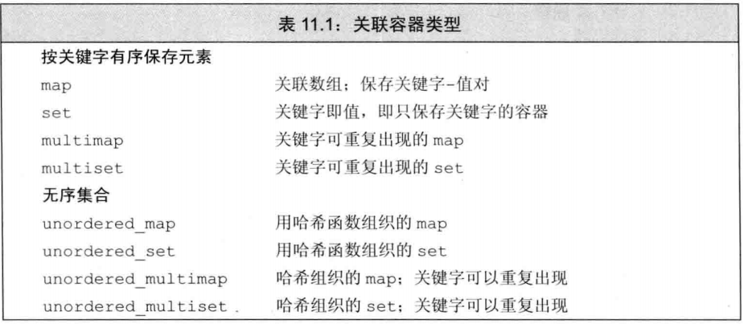
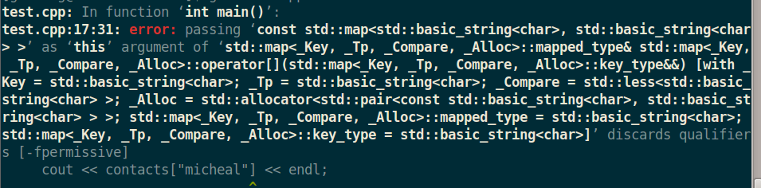
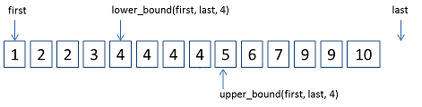
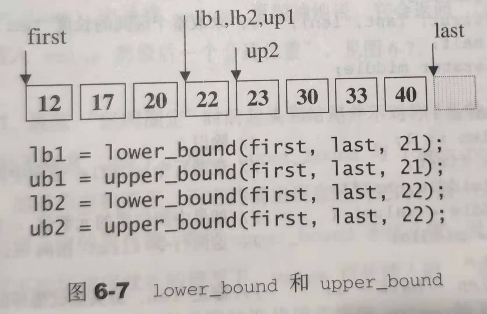

# 第十一章 关联容器

## 关联容器 和 顺序容器 有何区别？
关联容器 中的元素 是按关键字 来保存和访问的，而顺序容器 中的元素 是根据 它们在容器中的顺序  来保存和访问的。


&emsp;
## 标准库 提供了 哪些关联容器？
关联容器有8个，它们的区别主要体现在3个维度上：
> (1) 是 `map` 还是 `set`
> (2) 同一关键字是否可以重复出现
> (3) 是否按序保存
<div align="center">  </div>
<center> <font color=black> <b> 图1 关联容器类型 </b> </font> </center>

其中`map`、`multimap`定义在头文件 `map`中，`set` 和 `multiset`定义在头文件`set` 中
无序容器则定义在 `unordered_map` 和 `unordered_set`中


&emsp;
## map 和 set 有何区别？
`map`中的元素是key-value对，`set`只保存了key


&emsp;
## 如何定义一个 map 和 set ？
map 需要分别指定 key 和 value 的类型；
set 只需要指定 key 的类型，因为它没有值。
```cpp
map<string, size_t> word_count;
set<string>exclude;
```


&emsp;
## 编写一个程序，从标准输入读单词，统计每个单词出现的次数，并忽略: `"The", "But", "And", "Or", "An", "A","the", "but", "and", "or", "an","a"`
```cpp
int main ()
{
    map<string, size_t> word_count;
    set<string>exclude{"The", "But", "And", "Or", "An", "A","the", "but", "and", "or", "an","a"};
    string word;

    while(cin >> word){
        if(exclude.find(word) == exclude.end()){
            ++word_count[word];
        }
    }

    for(auto &w : word_count){
        cout << w.first << " : " << w.second << endl;
    }

    return 0;
}
```
### 遇到的问题
#### &emsp;1) 如何跳出 `while(cin >> word)`?
&emsp;&emsp;`CTRL` + `d`即可，因为`CTRL` + `d`是EOF


&emsp;
## 关联容器对它的 关键字 有何要求？
#### 有序容器 的要求
&emsp;&emsp;对于**有序关联容器**，其关键字类型 必须定义 元素比较的方法，默认情况下，标准库使用关键字类型的 `<` 运算符来比较两个关键字
# TODO:  
#### 无序容器 的要求


&emsp;
## pair 类型
#### 定义在哪？
&emsp;&emsp; 定义在头文件 `utility` 中
#### 如何定义一个 pair类型?
&emsp;&emsp;创建一个pair类型时，必须指定两个类型名：
```cpp
pair<string, string> anon;
pair<string, size_t> word_count;
```
#### 不给pair类型指定初始值时会发生什么？
&emsp;&emsp;pair将使用默认初始化，即调用pair的默认构造函数进行初始化，但pair的默认构造函数将对数据成员进行值初始化。
#### pair类型 有哪些数据成员？
first 和 second成员。比如对于`pair<string, string> anon{"Micheal", "Jordan"};`来说，`anon.first` 就是 "Micheal"，`anon.second` 就是 "Jordan"
#### pair类型 和其它 关联容器有何 关联？
&emsp;&emsp; map的元素是pair类型的。
#### make_pair()的作用是？原理是？
对于`make_pair(v1, v2)` ：
&emsp;&emsp; 作用：将返回一个用 v1 和 v2 初始化的 pair。
&emsp;&emsp; 原理：pair的类型 将通过 v1 和 v2 的类型 推断得到。
#### 


&emsp;
## 关联容器 有哪些顺序容器没有的 类型别名？
| 类型别名    | 解释                                                                           |
| ----------- | ------------------------------------------------------------------------------ |
| key_type    | 关键字的类型                                                                   |
| mapped_type | 键值 的类型(**只适用于map**)                                                   |
| value_type  | **对于set**，与key_type相同； **对于map**，为pair<const key_type, mapped_type> |
#### &emsp;下面的v1 - v5 分别是什么类型？
```cpp
1. set<string>::value_type v1;         
2. set<string>::key_type v2;           
3. map<string, int>::value_type v3;    
4. map<string, int>::key_type v4;      
5. map<string, int>::mapped_type v5;   
```
结果：
&emsp; 1.  v1 is a string
&emsp; 2.  v2 is a string
&emsp; 3.  v3 is a pair<const string, int>
&emsp; 4.  v4 is a string
&emsp; 5.  v5 is an int


&emsp;
## 解引用关联容器的迭代器将得到什么？
&emsp;&emsp;将得到一个 类型为容器的 value_type 类型 的值的引用


&emsp;
## 操作 map 时需要注意什么？
&emsp;&emsp; map的 关键字的类型 是 `const` 的，因此不能修改map的关键字的值：
```cpp
map<string, string> authors = { {"Joyce", "James"}, {"Austen", "Jane"}, {"Dickens", "Charles"} };
auto map_it = authors.begin();
cout << (*map_it).first; // 正确，输出key的值
cout << map_it->first;   // 正确，输出key的值
map_it->first = "Lebron"; // 错误，关键字是const的，不能修改；
map_it->second = "jack"  // 正确，可以修改 元素的值
```


&emsp;
## 操作 set 时需要注意什么？
&emsp;&emsp;虽然 `set` 同时定义了 `iterator` 和 `const_iterator` 两种迭代器类型，但是 `iterator` 也只能读取 `set` 中的元素，因为和`map`一样，`set` 中的关键字也是 `const`的：
```cpp
set<int> iset = {1, 2, 3, 4, 5};
auto set_it = iset.begin();
if(set_it != iset.end()){
    *set_it = 42; // 错误，set中的关键字是 const 的，不能修改。
}
```


&emsp;
## 对 关联容器 使用 泛型算法 时需要注意什么？
&emsp;&emsp; 一般不建议对 关联容器使用 泛型算法，因为：
1) map 和 set 的关键字都是`const`的，这就意味着不能将关联容器传递给 **修改** 或 **重排** 元素的算法。
2) 虽然关联容器可以用于 只读取元素的算法，但是这些算法一般都要搜索序列，因为关联容器不能通过它们的关键字进行快速查找，所以效率很低，远远比不上 关联容器专用的算法。
3) 在实际应用中，我们一般将关联容器作为一个源位置 或 目的位置，比如可以使用`copy()`算法 从关联容器 拷贝到 另一个序列。


&emsp;
## 往map插入元素有哪几种方式？它们有何区别？
一共有五种方式：
&emsp;&emsp;**其中四种** 是以不同的方法调用 `insert()`。
&emsp;&emsp;对于map来说，因为`map.insert()`的形是 pair类型，因此这四种方法指的是通过四种不同的方法来构造 一个pair，然后插到map里面，也就是说这几种方法 **本质上 都是 往map中插入一个 pair类型**：
1) 传一个 **value_type** 给insert()     (map的value_type是 pair类型)
2) 传一个 **pair 类型** 给insert()      (直接传 pair类型)
3) 利用**make_pair** 构造一个pair  
4) 传一个 **花括号的值**                (用花括号构造 pair类型)
```cpp
// four ways to add word to word_count
word_count.insert(map<string, size_t>::value_type(word, 1));    // 传一个 **value_type** 给insert()
word_count.insert(pair<string, size_t>(word, 1));               //  传一个 **pair 类型** 给insert()
word_count.insert(make_pair(word, 1));                          // 利用**make_pair** 构造一个pair 
word_count.insert({word, 1});                                   // 传一个 花括号的值(用花括号构造 pair类型)
```
**剩下的一种** 是以数组的形式插入：
&emsp;&emsp; 以数组的形式插入时，若map中有这个关键字，此时insert 操作是无法插入的，但是用这种方式会直接覆盖掉原先的数据：
```cpp
map<string, size_t> word_count{("python", 1), ("cpp", 2)};
word_count["java"] = 3; // 插入
word_count["cpp"] = 4;  // 覆盖
```


&emsp;
## 如何判断 map 的 insert操作 是否成功？
根据`insert()`的返回值判断：
对于 添加单一元素的 `insert()` `emplace()`，它们会返回一个 `pair`，用来告诉我们是否插入成功，返回的`pair`成员如下：
&emsp; `first` 成员是一个迭代器，指向具有给定关键字的元素；
&emsp; `second`成员是一个bool值，`true`表示插入成功，`false`表示插入失败（即元素已在容器中）；
```cpp
map<string, size_t> word_count; // empty map from string to size_t
string word;
while(cin >> word){
    auto ret = word_count.insert({word, 1});
    if (ret.second == false)
        ++ret.first->second;
}
```
#### 如何理解上面的 `++ret.first->second;`
运算符`.` 运算符 `->`，先执行而`++`运算符比它俩都要低级，因此从左往右，先执行 运算符`.`，再执行 运算符 `->`，最后执行 `++`，也就是说，这个语句等同于：
```cpp
++((ret.first)->second);
```
#### 上面的 `word_count` insert操作的 返回值的类型是什么？
```cpp
pair<map<string, size_t>::iterator, bool>
```
写起来有些复杂，可以用`auto`简化。


&emsp;
## multiset 和 multimap 的插入
#### multimap 和 map 的插入 有何异同？
**相同点**：
&emsp; 它们都可以通过`insert()`插入一个`pair`类型
**不同点**：
&emsp; (1) multimap 不能通过 下标的方式 插入元素，因为 multimap 没有下标操作；
&emsp; (2) `insert()`的返回值不一样，multimap 在insert操作成功后将 返回一个 指向刚插入的那个元素的迭代器，因为multimap总是可以插入成功，所以没必要和map一样返回一个bool来判断是否插入成功。


&emsp;
## 删除关联容器中 的元素
#### 有几种方式？
&emsp;&emsp;和顺序容器一样，关联容器也支持 通过迭代器来删除一个 或 一个范围的 元素：
```cpp
word_count.erase(word_count.begin())                            // 通过迭代器删除首元素
word_count.erase(word_count.begin(), word_count.begin() + 5)    // 删除头5个元素
```
&emsp;&emsp;关联容器还有一个 特有的删除操作：它接收一个 `key_type`参数，它会删除所有和`key_type`相匹配的元素，并返回删除的元素个数(map、set就一个，multi版本的可能有多个)
```cpp
multimap<string, string> authors;
authors.insert({"Barth, John", "Sot-Weed Factor"});
authors.insert({"Barth, John", "Lost in the Funhouse"});

auto cnt = authors.erase("Barth, John"); // cnt的值为2
```


&emsp;
## 关联容器的下标操作
#### 哪些 有 下标操作？
只有 map 和 unordered_map 有，因为：
set只有关键字，没有和关键字相关联的值，因此不需要下标操作；
multimap、unordered_multimap 是因为它们存在多个值和一个关键字相关联，下标操作会引起歧义，因此没有。
#### 下表操作有几种？ 它们有何区别？
两种：
| 操作      | 解释                                                           |
| --------- | -------------------------------------------------------------- |
| `c[k]`    | 若关键字k存在则返回它映射的值，若不存在则插入(进行值初始化)    |
| `c.at[k]` | 若关键字k存在则返回它映射的值，若不存在则抛出 out_of_range异常 |
#### 使用 下标操作时需要注意什么？
&emsp;&emsp;由于关联容器的下标操作和vector等顺序容器很不一样：若将一个不在关联容器中的关键字作为下标，将会插入一个具有此关键字的的元素到map中，因此对于那些 被声明为const的map，使用下标操作将会报错！
```cpp
int main ()
{
    const map<string, string>contacts{{"Barth", "John"}, {"Bruce", "Li"}, {"Jay", "chou"}} ;
    auto map_itr = contacts.begin();
    while(map_itr != contacts.end()){
        cout << "Key:" << map_itr->first << ", Value" << map_itr->second << endl;
        ++map_itr;
    }
    cout << contacts["micheal"] << endl;
    return 0;
}
```
上面的代码未能通过编译，报错如下：
<div align="center">  </div>
<center> <font color=black> <b> 图2 下标访问const类型的map报错 </b> </font> </center>

##### 修改
&emsp;&emsp; 改成用 `at()` 访问不存在的关键字，即将倒数第二行改成:
```cpp 
cout << contacts.at("micheal") << endl;
```
最后顺利通过编译，但运行时报错如下：
>Key:Barth, ValueJohn
Key:Bruce, ValueLi
Key:Jay, Valuechou
terminate called after throwing an instance of 'std::out_of_range'
  what():  map::at
Aborted (core dumped)

**报错原因：**
&emsp;&emsp; 虽然用 `at()` 访问不存在与map中关键字不会往map中插入新值，这绕开了 `const` 的限制，但会抛出一个 运行时异常 `out_of_range`。
#### 如果只是想知道 某个关键字 是否在 map或set 中，应该怎么写？
&emsp;&emsp; 可以用 `at()` 访问该关键字，然后捕捉  `out_of_range` 异常:
```cpp
int main ()
{
    map<string, string>contacts{{"Barth", "John"}, {"Bruce", "Li"}, {"Jay", "chou"}};

    try{
        cout << contacts.at("micheal") << endl;
    }catch (out_of_range){
        cout << "micheal is not in map contacts! " << endl;
    }

    return 0;
}
```
运行结果：
> micheal is not in map contacts! 

**更简单的方法**：使用 `find()`
```cpp
int main ()
{
    map<string, string>contacts{{"Barth", "John"}, {"Bruce", "Li"}, {"Jay", "chou"}};

    if(contacts.find("micheal") ！= contacts.end()){
        cout << contacts.at("micheal") << endl;
    }else{
        cout << "micheal is not in map contacts! " << endl;
    }

    return 0;
}
```


&emsp;
## 关联容器的查找操作
#### 如要查找某一关键字是否在 容器中，推荐使用哪个方法？
&emsp;&emsp; 因为下标和at操作只适用非const的map和unordered_map（下标可能会插入元素，at操作 可能会抛out_of_range异常），使用`find()`操作比较合适（`count()`操作也可以）。
#### 如何统计一个关键字在 某关联容器中出现的次数？
&emsp;&emsp; 使用`c.count(key)`比较合适
#### 如何查找 容器中 第一个 关键字 不小于(不大于)key 的元素？ 使用时需要注意什么？
&emsp;&emsp; 使用`lower_bound()`、`upper_bound()`
&emsp;&emsp; `lower_bound()` 和 `upper_bound()`不适合无序容器。
#### 如何在multimap 和 multiset中查找元素？
&emsp;&emsp;对于 multimap 和 multiset，如果它们里面含有重复的关键字，那这些重复的关键字一定是相邻存储的，我们可以利用这一特性：
**方法一**：
```cpp
int main()
{
    multimap<string, string>contacts{{"Barth", "John"}, {"Bruce", "Li"}, {"Jay", "chou"}, {"Bruce", "Willis "}};
    string target = "Bruce";
    auto cnt = contacts.count(target);
    if(cnt > 0){
        auto beg_itr = contacts.find(target);
        for(; cnt > 0; --cnt, ++beg_itr)
            cout << "Key:" << beg_itr->first << ", Value: " << beg_itr->second <<endl;
    }

    return 0;
}
```
**遇到的错误：**
&emsp; multimap也是放在头文件 `map` 里面的。
**方法二**：
用  `lower_bound()` 和 `upper_bound()` 来获取一个区间：
```cpp
int main()
{
    multimap<string, string>contacts{{"Barth", "John"}, {"Bruce", "Li"}, {"Jay", "chou"}, {"Bruce", "Willis "}};
    string target = "Bruce";

    // 1. multimap 中的关键字 是基本有序的;
    // 2. lower_bound(target)获取的是第一个为关键字为 target 的元素的迭代器；
    // 3. upper_bound(target)获得的是第一个 关键字 大于 target 的元素的迭代器；
    // 4. 因此 beg 和 end形成了一个区间，刚好包含了值为 target 的区间
    // 5. 更多关于 lower_bound() 和 upper_bound() 的描述可以看本文中 对它们专门的讲解。
    for(auto beg = contacts.lower_bound(target), end = contacts.upper_bound(target); beg != end; ++beg)
        cout << "Key:" << beg->first << ", Value: " << beg->second <<endl;

    return 0;
}
```
**方法三：**
&emsp;&emsp;还有一种方法是用  `equal_range` 函数，这是这几种方法中最简单的方法
```cpp
int main ()
{
    multimap<string, string>contacts{{"Barth", "John"}, {"Bruce", "Li"}, {"Jay", "chou"}, {"Bruce", "Willis "}};
    string target = "Bruce";

    auto rang_pair = contacts.equal_range(target);

    while(rang_pair.first != rang_pair.second){
        cout << "Key:" << rang_pair.first->first << ", Value: " << rang_pair.first->second     <<endl;
        ++rang_pair.first;
    }
    return 0;
}
```
#### 在一个关联容器中查找元素的操作 列表
| 操作             | 解释                                                                                    |
| ---------------- | --------------------------------------------------------------------------------------- |
| c.find(k)        | 返回一个迭代器，指向第一个关键字为k的元素，若k不在容器中，则返回尾后迭代器              |
| c.count(k)       | 返回关键字等于k的元素的数量。对于不允许重复关键字的容器，返回值永远是0或1               |
| c.lower_bound(k) | 返回一个迭代器，指向第一个关键字不小于k的元素                                           |
| c.upper_bound(k) | 返回一个迭代器，指向第一个关键字大于k的元素                                             |
| c.equal_range(k) | 返回一个迭代器pair，表示关键字等于k的元素的返回。若k不存在，pair的两个成员均等于c.end() |


&emsp;
##  lower_bound() 、 upper_bound()、  equal_range()
#### 它们的作用是？
**定义**：
和 泛型算法 的 `lower_bound()`、`upper_bound()` 一样，它俩都是搜索算法：
`map::lower_bound(key)` : 返回map中 **第一个 大于或等于key**的迭代器
`map::upper_bound(key`) : 返回map中 **第一个 大于key** 的迭代器
定义过于晦涩，我们用代码和图来解释一下把，我们都知道这两个都是 关键字的 搜索算法，那搜索的情况只有两种：关键字存在 或 不存在：
**关键字不存在时**：
&emsp;&emsp;`mp.lower_bound(4)` 和 `mp.upper_bound(4)` :可以看到`mp.lower_bound(4)`  指向了第一个4，`mp.upper_bound(4)`指向了最后一个4的下一个元素，就有点像，它俩刚好行车过了一个区间，将 22 包围了起来
<div align="center">  </div>
<center> <font color=black> <b> 图3 关键字存在 </b> </font> </center>

**关键字存在时**：
&emsp;&emsp;如下图所示，`mp.lower_bound(21)` 和 `mp.upper_bound(21)` 都指向了同一个位置，即 20 和 22中间，它俩的返回值的原则是：**在不破坏排序状态的原则性，可插入的第一个位置**，在这个原则下，如果 待查找 的值大于[first, last]之间的所有元素，则返回last。
<div align="center">  </div>
<center> <font color=black> <b> 图3 关键字存在 </b> </font> </center>

&emsp;&emsp; 对于 `equal_range()`，它返回一个pair对象，其first和second成员都成为迭代器，且分别指向输入序列中所有值等于 val 的元素所组成的子序列的起始及末尾（即最后一个元素之后的位置）位置，first成员等于 `lower_bound()` 执行于同一输入序列后的返，second成员的值等同于 `upper_bound()` 执行于同一输入序列后的返回。

####  lower_bound()、 upper_bound() 的原理
&emsp;&emsp;它俩都是基于 二分查找
#### 使用 lower_bound()、upper_bound() 时需要注意什么？
&emsp;&emsp; 因为它俩都是基于 二分查找，因此它们**只能用于 有序区间**，也就是说 `unordered` 系列的关联容器都不能用。


&emsp;
## 无序容器


&emsp;
## 有序关联容器 和 无序关联容器
#### 底层数据结构上的差异
&emsp;&emsp; map内部是红黑树，在插入元素时会自动排序，而无序容器unordered_map内部是散列表，通过哈希而不是排序来快速操作元素，使得效率更高

#### 性能上的对比
&emsp;&emsp; map内部是红黑树，在插入元素时会自动排序，而无序容器unordered_map内部是散列表，通过哈希而不是排序来快速操作元素，使得效率更高


&emsp;
## STL中的map 和 python的map 有何异同？


&emsp;
## 关联容器的底层原理
&emsp;&emsp;类似于顺序容器，关联容器也是模板。
### 1) set的底层原理？

&emsp;
### 2) map的底层原理
