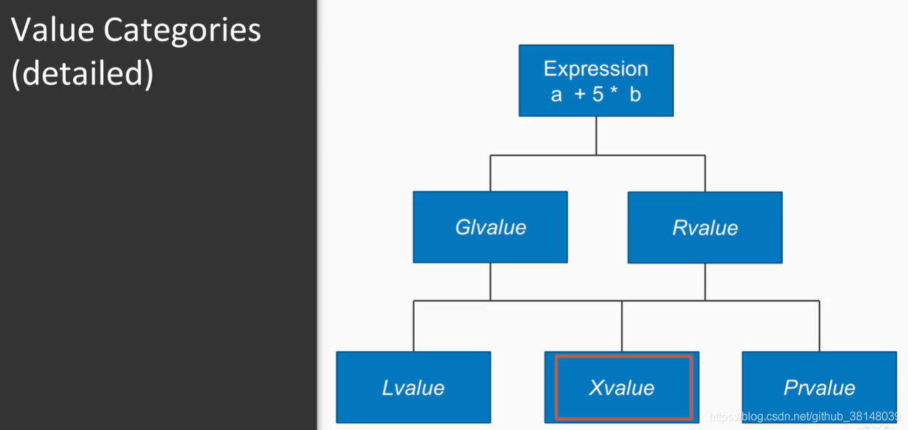

## 1. 左值 和 右值
### 1.1 什么是 左值？什么是 右值 ？
&emsp;&emsp; **左值**是对应(refer to)内存中有确定存储地址的对象的表达式的值；而**右值**是所有不是左值的表达式的值。因而，右值可以是字面量、临时对象等表达式。

### 1.2 左值 和 右值 如何细分？
&emsp;&emsp; 一个 lvalue 是通常可以放在等号左边的表达式；
&emsp;&emsp; 一个 rvalue 是通常只能放在等号右边的表达式。
&emsp;&emsp; 根据C++11标准，每个表达式可分为：lvalue、xvalue（expiring value）或 prvalue（pure rvalue），另外lvalue和xvalue合称glvalue(“generalized” lvalue)，xvalue和prvalue合称rvalue。也就是说，关于左值和右值，一共有五个新名词：
 概念 | Column B |
 ---------|----------|
 lvalue   | 左值   | 
 xvalue   | 将亡值 | 
 glvalue  | “generalized” lvalue | 
 rvalue   | 右值   | 
 prvalue  | 纯右值 | 
其中，rvalue和glvalue是一个大类别：lvalue和xvalue合称glvalue(“generalized” lvalue)，xvalue和prvalue合称rvalue:
> glvalue（泛左值） = lvalue （传统意义上的左值）+ xvalue（消亡值，通过右值引用产生）
> rvalue （传统意义上的右值） = prvalue（纯右值） + xvalue
>
<div align="center">  </div>
<center> <font color=black> <b> 图1 下标访问const类型的map报错 </b> </font> </center>

下面对于几个细分的类别，我们来介绍一下：
#### 1.2.1 左值(lvalue)
左值 lvalue 是有标识符、可以取地址的表达式，最常见的情况有：
  * 变量、函数或数据成员
  * 返回左值引用的表达式
    如:
	```cpp
	++x、x = 1、cout << ' '
	int x = 0;
	cout << "(x).addr = " << &x << endl;
	cout << "(x = 1).addr = " << &(x = 1) << endl;
	cout << "(++x).addr = " << &++x << endl;
	//cout << "(x++).addr = " << &x++ << endl; // error
	cout << "(cout << ' ').addr=" << &(cout << ' ') << endl;
	```
  * 字符串字面量是左值，而且是不可被更改的左值。字符串字面量并不具名，但是可以用&取地址所以也是左值。
    如:
    ```cpp
     "hello",在c++中是 char const [6] 类型，而在c中是 char [6] 类型
      cout << "(\"hello\").addr=" << &("hello") << endl;
      如果一个表达式的类型是一个lvalue reference (例如, T& 或 const T&, 等.)，那这个表达式就是一个lvalue。
      ```
#### 1.2.2 纯右值(prvalue)
纯右值 prvalue 是没有标识符、不可以取地址的表达式，一般也称之为“临时对 象”。最常见的情况有：
  * 返回非引用类型的表达式，如 `x++`、`x + 1` 
  * 除字符串字面量之外的字面量, 如 42、`true`，`nullptr`
  * 
#### 1.2.3 将亡值(xvalue)
下面是xvalue的定义，摘自stackflow：
> (an “eXpiring” value) also refers to an object, usually near the end of its lifetime (so that its resources may be moved, for example). An xvalue is the result of certain kinds of expressions involving rvalue references. [Example: The result of calling a function whose return type is an rvalue reference is an xvalue.]
>  
翻译过来就是：
> xvalue 是一个对象的引用，通常
> 
  * 隐式或显式调用函数的结果，该函数的返回类型是对所返回对象类型的右值引用
      ```cpp
        int&& f(){
            return 3;
        }

        int main()
        {
			// The expression f() belongs to the xvalue category, 
			// because f() return type is an rvalue reference to object type.
            f(); 
            return 0;
        }
      ```
  * 对对象类型右值引用的转换
      ```cpp
        int main()
        {
            // The expression static_cast<int&&>(7) belongs to xvalue category,
            //  because it is a cast to an rvalue reference to object type.
            static_cast<int&&>(7); 
            std::move(7); // std::move(7) is equivalent to static_cast<int&&>(7).
            return 0;
        }
      ```
  * 类成员访问表达式，指定非引用类型的非静态数据成员，其中对象表达式是xvalue
      ```cpp
        struct As{
            int i;
        };

        As&& f(){
            return As();
        }

        int main()
        {
			// The expression f().i belongs to the xvalue category, because As::i 
            // is a non-static data member of non-reference type, 
            // and the subexpression f() belongs to the xvlaue category.
            f().i; 
            return 0;
        }
      ```


### 1.2 是不是说 能被赋值的就是 左值？
&emsp;&emsp; 不是，**能否被赋值不是区分C++左值与右值的依据**，比如说，`const左值`是不可赋值的；而作为临时对象的右值可能允许被赋值。

### 1.3 左值 和 右值 的根本区别在于？
**左值与右值的根本区别在于** 是否允许取地址`&`运算符获得对应的内存地址。

### 1.4 左值和右值在使用上有何区别？
&emsp;&emsp; 左值可以放到等号左边，右值只能放到右边。但如有需要，左值可以转换为右值，反之则不可。


### 如何区分左值和右值？
&emsp;&emsp; 想要对左值和右值进行精确定义是一件很难的事(c++11标准基本上是通过举例来说明一个表达式是否是一个lvalue还是rvalue的)，但实践当中，下面的定义就足够了：
  * (1) 如果你可以对一个表达式取地址，那这个表达式就是个lvalue。
  * (2) 如果一个表达式的类型是一个lvalue reference (例如, T& 或 const T&, 等.)，那这个表达式就是一个lvalue。
  * (3) 其它情况，这个表达式就是一个rvalue。从概念上来讲(通常实际上也是这样)，rvalue对应于临时对象，例如函数返回值或者通过隐式类型转换得到的对象，大部分字面值(e.g., 10 and 5.3)也是rvalues。


### 为什么要分左值 和 右值？


## 15 左值引用(lvalue References) 和 右值引用(Rvalue References)
### 15.1 左值引用是什么？
&emsp;&emsp; 左值引用 其实就是我们之前用的引用：
```cpp
int x = 20;
int& rx = x;   // 定义引用时必须初始化
```

### 15.2 什么是右值引用？
&emsp;&emsp; 所谓 右值引用 就是 必须绑定到右值的引用。 我们通过`&&` 而不是`&`来获取 右值引。
&emsp;&emsp; 右值引用 有一个很重要的性质：只能绑定到 一个将要销毁的对象，因此我们可以自由地将一个右值引用的资源“移动”到另一个对象。

### 15.3  右值引用 的作用是？（为什么需要右值引用？）
&emsp;&emsp; 之所以则C++11中引入了**右值引用**，是为了支持 移动操作。

### 15.4 怎么使用 右值引用？
右值引用 有着和左右引用完全相反的特性：我们可以将一个右值引用绑定到 要求转换的表达式、字面常量 或 返回右值的表达式 上，但不能将右值引用直接绑定到一个左值上：
```cpp
int i = 42;
int &r = i;		//正确，r是i的左值引用
int &&rr = i;	//错误，不能将一个右值引用绑定到一个左值上
int &r2 = i * 42;	//错误，i*42是一个右值
const int &r3 = i * 42;	//正确，可以将一个const的引用绑定到一个右值上
int &&rr2 = i * 42;	 //正确，将rr2绑定到右值上 
```

### 15.5 右值引用 的好处在哪？
&emsp;&emsp; 右值引用就是为了实现移动语义与完美转发所需要而设计出来的新的数据类型。
&emsp;&emsp; 右值引用应该是C++11引入的一个非常重要的技术，因为它是移动语义（Move semantics）与完美转发（Perfect forwarding）的基石：

### 15.6 左值 和 右值在持久性上有何差异？
左值有持久的状态，而右值要么是字面值常量，要么是在表达式求值过程中创建的临时对象。
由于右值引用只能绑定到临时对象，可以得知：
>所引用的对象将要被销毁
> 该对象没有其它用户
> 
这两个意味着 使用右值引用的代码 可以自由地接管所引用的对象资源。

### 15.7 能不能将 右值引用 绑定到一个变量上？
&emsp;&emsp; 不能，我们不能将一个 右值引用 绑定到一个变量上，即使这个变量是右值引用类型也不行：
```cpp
int &&rr1 = 42; 	//正确，字面常量是右值
int &&rr2 = rr1;	//错误，表达式rr1是左值
```

### 15.8 有没有什么办法可以将 右值引用 绑定到一个变量上？
&emsp;&emsp; 虽然不能将一个右值引用 直接绑定到一个左值上，但我们可以显式的将一个左值转换为 对应的右值引用类型：使用 标准库函数`move()`可以获得绑定到左值上的右值引用，此函数定义在 头文件`utility`中：
```cpp
int &&rr1 = 42; 
int &&rr3 = std::move(rr1); // 正确
```

### 15.9 传 右值引用 给一个函数时，为什么不把它声明为`const`？
&emsp;&emsp; 因为在定义一个 接收右值引用参数的函数时，我们希望可以从实参“窃取”数据，这意味着我们需要改变实参，因此不能声明为`const`


## `++`和`--` 的 前缀版本、后缀版本 有何区别？
前缀版本返回左值，后缀版本返回右值。
前自增是左值，可以取地址，即&++a）


## 函数返回一个右值

&emsp;
&emsp;
## 参考文献
1. [现代C++之万能引用、完美转发、引用折叠](https://zhuanlan.zhihu.com/p/99524127)
2. [C++标准库功能:Xvalue,prvalue和Lvalue](https://blog.csdn.net/github_38148039/article/details/104138763)
3. [关于值类型的详细解读：lvalue,rvalue,xvalue,prvalue,glvalue](https://blog.csdn.net/yanglingwell/article/details/51173063)
4. [Value categories](https://en.cppreference.com/w/cpp/language/value_category#cite_ref-1)